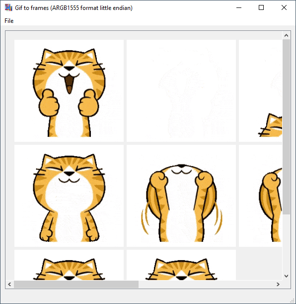
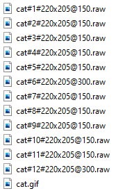

# Gif to Frames 

This application takes a gif as input and converts it to frames "Raw" format for STM32F7xx Disco.
Each frame is a separate file. 
Pixeldata is stored as ARGB1555 in little endian.
Via the name of the Raw you get information about the index, width, height and frameDelay:

	cat.gif -> cat#1#220x205@150.raw  
	1st frame (starts at 1 not 0)  
	220 px wide  
	205 px high  
	Leave 150 ms before the next frame may be shown.

## Screenshots

This is the generated output:

